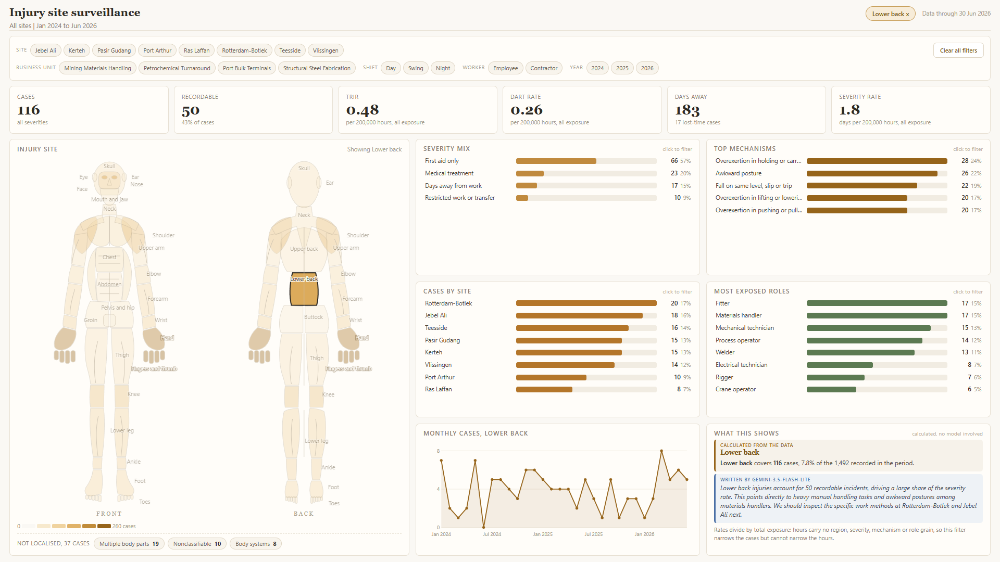
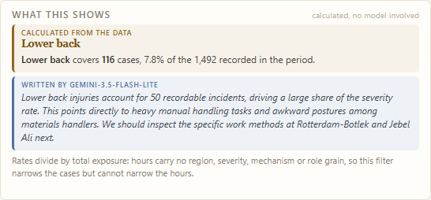

# Kelvara HSE, injury site surveillance

**A whole Power BI report page as one DAX measure: a human body map, a filter
bar, KPIs and four panels, all rendered in JavaScript.**

Kelvara Industrial Services is fictional. Every number is generated by a seeded
script. There is no real worker or patient data anywhere in this folder.



*Lower back selected. Every panel has narrowed to it, the figure keeps showing
every region, and the explanation pane underneath carries two clearly separated
blocks: amber for what was calculated, blue for what a model wrote.*



Both images are rendered from the exact bytes `[JS Body Map]` returns from a
running Power BI Desktop model, pulled over ADOMD. Not a mock-up and not a local
rebuild.

---

## What makes this one different from `trailpeak/`

TrailPeak proved the technique on a financial page. This one puts it under
three constraints that a safety report brings and a P&L does not.

**The hero visual is a drawing, not a chart.** Twenty-seven body regions,
front and back, shaded by case count and individually clickable. The geometry
is baked once at build time from an approved design and re-grouped onto the
OIICS body-part codes.

**Some data cannot be drawn.** OIICS has three codes that no figure can carry:
*multiple body parts*, *body systems* and *nonclassifiable*. About one case in
forty lands there. Dropping them silently would leave the figure totalling less
than the KPI beside it, so the page states them under the map instead. Shaded
regions plus that strip always reconcile to the headline count.

**The denominator is not the numerator.** A body region is a property of an
injury; hours worked are a property of exposure. Selecting *Fingers and thumb*
must filter the cases and leave the hours alone, or a region would appear to
have a worse TRIR purely for being selected. Selecting a *site* must filter
both. Both rules are asserted in the test suite.

Exposure is recorded by site, shift, worker class and month, so a region,
severity, mechanism or role selection narrows the numerator and cannot narrow
the denominator. The rate cards say **"per 200,000 hours, all exposure"** when
that is the case, rather than printing a figure that quietly mixes a filtered
numerator with an unfiltered one.

**Every panel cross-filters, the way a native visual does.** Body regions,
severity, site, mechanism and role are all clickable, additive within a group,
and combine across groups. A panel ignores its OWN selection and honours every
other one, so clicking *Welder* leaves the roles panel listing every role with
Welder marked while the map, the KPIs and the other panels narrow. Percentages
inside a self-excluded panel divide by that panel's own universe: dividing by
the page's filtered case count made the clicked row read 100% and its
neighbours 97%, of a set they are not in.

---

## Files

| Path | What it is |
|---|---|
| [`src/kelvara-bodymap.src.js`](src/kelvara-bodymap.src.js) | **The renderer.** Filter bar, KPIs, body figure, severity mix, site, mechanism and role panels, monthly trend. Readable source. |
| [`kelvara-bodymap.js`](kelvara-bodymap.js) | Generated: baked geometry + baked dimension labels + the renderer. This is what the measure inlines. |
| [`body-baked.js`](body-baked.js) | Generated: the figure geometry, 27 regions x 2 views, plus label positions and decorative contours. |
| [`bake_body.py`](bake_body.py) | Lifts the figure out of the approved design and re-groups it onto OIICS regions. |
| [`build_runtime.py`](build_runtime.py) | Bakes the dimension labels and stitches the runtime together. |
| [`../dax/kelvara-bodymap.dax`](../dax/kelvara-bodymap.dax) | The measure. Ships facts at row grain. |
| [`preview-page.html`](preview-page.html) | The whole page, offline. Open it in a browser, no server needed. |
| [`preview-figure.html`](preview-figure.html) | Just the figure, for working on the geometry. |
| [`anatomy.spec.js`](anatomy.spec.js) | 25 geometry tests. |
| [`renderer.spec.js`](renderer.spec.js) | 52 renderer tests. |
| [`bake_ai.py`](bake_ai.py) | Generates one explanation per body region at build time and grounds-checks each. |
| [`ai-baked.json`](ai-baked.json) | The 30 generated explanations, shipped as data inside the measure. |
| [`mutate.py`](mutate.py) | Injects real defects to prove the suite can fail. |
| [`ai_grounding.js`](ai_grounding.js) | Live audit of the model layer: how often it cites a figure it was not given. |
| [`data/generate_data.py`](data/generate_data.py) | The seeded generator. Rebuilds every CSV from scratch, and asserts its own targets. |
| [`data/csv/`](data/csv/) | The 16 generated tables. Synthetic, seed 42. |

---

## The architecture, and why

```
   DAX measure                     HTML Content visual (null-origin iframe)
   ───────────                     ────────────────────────────────────────
   1,492 incident rows   ──────>   window.__kvBody = { meta, f, h }
   1,440 exposure rows                        │
   + inlined runtime                          v
                                   filter bar ─> aggregate() ─> paint()
                                        ^                          │
                                        └──────── click ───────────┘
```

**The page is the visual.** A custom visual cannot cross-filter its neighbours
unless its own compiled TypeScript builds selection identities and calls
`selectionManager.select()`. HTML Content never does, so injected JavaScript can
never filter *out*. Rather than fight that, the page stops being several
visuals. When the page *is* the visual there is nothing to cross-filter to.

**So there are no native slicers.** A native slicer would work, since the
measure is evaluated in filter context like any other, but it would sit outside
the rendered surface and look bolted on. The filter bar is drawn by the same
JavaScript as everything else, and a click repaints in one frame with no query
round trip. Report and page level filters still apply.

**The measure ships facts, not aggregates.** Row grain, one row per incident,
carrying every key the filter bar exposes. Aggregating in DAX would be smaller
but would fix the filter set at build time, which is the thing being avoided.

**The runtime is inlined, not fetched from a CDN.** A CDN needs a loader, a
retry and a watchdog, and in the Service the first cold fetch is slow enough
that a naive watchdog fires before the script lands and reports a failure that
is not real. At 41KB against a ~2,100,000 character ceiling, inlining costs
2.6% of the budget and removes the whole failure mode.

**Only digits and commas cross the DAX boundary.** Dimension labels are baked
into the runtime rather than shipped from the model, which removes string
escaping from the payload entirely: a region name cannot break out of a JS
literal if it never travels through one. The filter caption is the single
genuinely dynamic string, and it goes through the full seven-step escape chain,
backslash first, because every escape written after it would otherwise be
escaped a second time.

**Locale safety.** Every number goes through `FORMAT ( x, "0" )`, which emits no
decimal or thousands separator in any locale. Without it a de-DE or fr-FR
workspace turns `1234.5` into `"1234,5"` and silently corrupts the array into
unparseable JavaScript.

---

## The explanation pane

Every selection rewrites a plain-English summary of what is on screen: how big
the selection is, whether it is more or less severe than normal, what is driving
it, what it cost, and which way it is heading.

It is computed from the same aggregate the panels are drawn from, so the prose
cannot drift from the chart beside it. No network, no key, no latency, correct
offline and correct on first paint.

### The model layer, and why it is baked rather than live

An API key placed anywhere in a DAX measure is readable by anyone who can open
the report or view the model. There is no safe way to call an API at render time
from inside a published Power BI report, so the live version only ever worked on
a developer machine and the pane in Power BI showed its calculated half alone.

[`bake_ai.py`](bake_ai.py) resolves that. It calls the model once per body
region at build time, checks each reply against the brief that produced it, and
stores the surviving text as data inside the measure:

```
OPENROUTER_KEY=... python bake_ai.py

baking 30 regions with google/gemini-3.5-flash-lite
regions with text    30 of 30
calls made           30
discarded ungrounded 0
```

Thirty calls, about a cent, roughly 1.5 seconds each. Every viewer then gets a
real model-written explanation with **no key in the report, no network call at
render time, and no latency**. There is a test asserting zero requests leave the
page.

**The limitation, stated plainly.** Each explanation was written about one
region's numbers and nothing else, so it is shown only when that region is the
sole selection. Add a site filter on top and it is withdrawn, because the
figures it cites would no longer be the figures on screen. The calculated
narrative takes over, and that one is correct under every combination. A test
asserts the withdrawal, because stale prose beside changed numbers is the
failure worth guarding against.

**It sends facts, not a screenshot.** The renderer already holds these numbers
exactly. Rendering them to pixels and asking a vision model to read them back is
slower, dearer, and lossy: a misread digit is undetectable.

#### Every reply is checked before it is kept

Measured over 24 live calls against `google/gemini-3.5-flash-lite`, **one reply
printed exposure hours as 209,000,000 against a real 20,900,000**. One extra
zero, in a safety report, phrased with complete confidence.

Prompting cannot rule that out, so it is not left to prompting. The brief
carries precomputed percentages and averages so the model never has to
calculate, and every figure in a reply is checked against that brief. Anything
citing a number it was not given is discarded whole.
[`ai_grounding.js`](ai_grounding.js) measures the rate against a live endpoint;
a 32-run audit after those changes found no ungrounded citations, mean latency
1983ms, mean length 69 words.

The optional live layer is still in the code, off unless a host sets
`window.__kvAI`, and it degrades to the calculated summary on any failure.

---

## Target visual

HTML Content, the **standard** (uncertified) edition:

```
htmlContent443BE3AD55E043BF878BED274D3A6855
```

The lite/certified edition (`…D3A6865`) sanitises the markup and strips script
tags, so it renders blank with no error. It cannot work, by design.

The page is budgeted to **1920 x 1080 exactly**. The visual is FitToPage, which
does not scroll: anything that overflows is not scrolled to, it is cut off. Every
band has a fixed height and only the body grid flexes.

---

## Running the tests

```
npm install @playwright/test
python data/generate_data.py     # optional, the CSVs are committed
python build_runtime.py            # regenerate kelvara-bodymap.js
python make_fixture.py             # build preview-page.html + the oracle
npx playwright test
```

78 tests in two suites.

**`anatomy.spec.js`** holds the figure to its placement rules: all 27 regions
present on the right views, sub-regions inside their parents, extremities
touching and proportioned to the limb they extend, stacked neighbours not
overlapping, paired limbs mirrored, vertical order anatomically correct, labels
not colliding or covering a neighbour, and every region exposing at least one
clickable pixel.

**`renderer.spec.js`** exercises every filter path and checks the numbers against an oracle computed a second
time, separately, straight off the raw CSV rows, so an aggregation mistake would
have to be made twice in two different shapes to pass. It also asserts the
denominator rules above, that the page fits 1920x1080 with nothing cut off, and
that re-running the runtime does not double-wire the click handlers.

### Proving the suite can fail

```
python mutate.py shift-fingers     # then npx playwright test, then re-bake
```

`mutate.py` injects defects that actually happened while this was being built:

| defect | what it models | tests failed |
|---|---|---|
| `shift-fingers` | geometry left in the wrong coordinate space | 5 |
| `merge-fingers` | a paired region derived from a both-sides bounding box | 5 |
| `pale-ink` | label ink picked from the shade instead of the fill | 1 |
| `bury-region` | a region painted over and unclickable | 1 |
| `label-on-eyes` | a label parked over a neighbouring region | 1 |

---

## Three things that cost real time

**`getBBox()` is pre-transform.** The back figure lives inside a
`<g transform="translate(370,0)">`, so its paths' own coordinates are still in
*front* space. Lifting a path without composing its ancestors' transforms drops
the back figure on top of the front one. The extraction now walks the tree
keeping a stack of group transforms.

**A bounding box is not a shape.** Deriving the fingers from
`region_bbox('hand')` produced a single capsule 216 units wide laid across the
hips, because that box spans *both* hands. Every adjacency and float test still
passed, because the bar happened to touch things. Paired regions are now
measured on one side and mirrored.

**A visual regression threshold that is too loose is worse than none.** The
baseline sat at `maxDiffPixelRatio: 0.02`, at which recolouring every label on
the page still counted as a match. The baseline went stale and a defect was
reviewed against an old picture for a full round. It is at `0.001` now.
